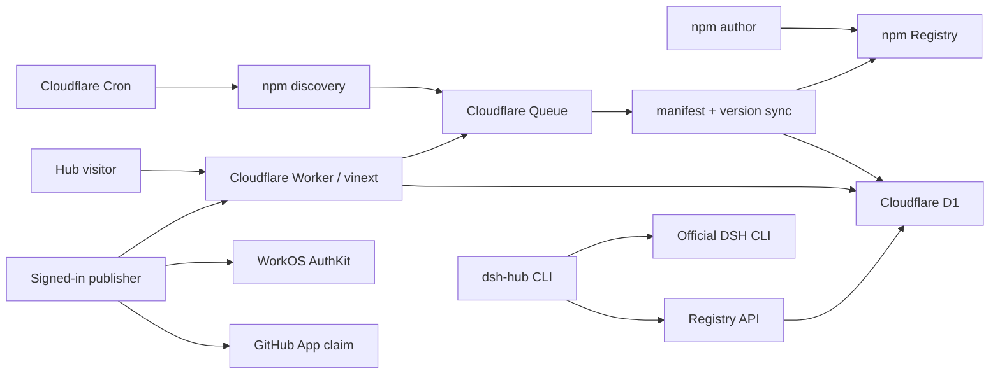

# DSH Plugin Hub teammate handover

更新时间：2026-08-18

## 先看这里

DSH Plugin Hub 是一个独立社区 Registry，负责发现、验证、索引和分发 DeepSeek Harness plugins / profiles。安装文件继续由 npm 提供，Hub 保存版本目录、精确 source、integrity、兼容信息和作者补充资料。

当前 MVP 已在 Staging 运行：

- 站点：<https://staging.dshpluginhub.ai>
- PR：<https://github.com/pax-beehive/dsh-plugin-hub/pull/1>
- 自动发现：每 6 小时执行
- 测试：`pnpm check`，77 项通过
- Production：保持原状，等待单独验收和资源隔离

## 15 分钟快速上手

环境要求：Node.js `>=22.13.0`、pnpm `10.33.0`。

```bash
git clone https://github.com/pax-beehive/dsh-plugin-hub.git
cd dsh-plugin-hub
pnpm install
cp .env.example .env
pnpm check
pnpm dev
```

本地没有 WorkOS / GitHub secret 时，公共页面、portable packages 和多数测试仍可运行。Dashboard、GitHub claim、真实邮件和远端部署需要对应 secret。

建议阅读顺序：

1. 本文
2. [`README.md`](../README.md)
3. [`docs/publishing.md`](publishing.md)
4. [`docs/npm-sync.md`](npm-sync.md)
5. [`db/schema.ts`](../db/schema.ts)
6. [`lib/npm-sync.ts`](../lib/npm-sync.ts)
7. [`worker/index.ts`](../worker/index.ts)

## 最终架构



设计边界：

- npm keywords 只负责候选发现。
- `dsh.bundle` / `dsh.profile` manifest 决定准入。
- `(package, version)` 收录后保持不可变。
- npm 新版本创建新的 Hub version。
- npm 缺失的旧版本保留，并标记 `yanked`。
- Hub 不复制 npm tarball。
- 自动发现的 listing 初始为 unclaimed。
- GitHub repository access 用于作者认领。
- 作者补充的描述、截图、分类、兼容性和 HMR 在后续 npm sync 中保留。

## 三条用户流程

### 普通作者

1. 按 [`docs/publishing.md`](publishing.md) 准备 `package.json`。
2. 发布到 npm。
3. 等待自动发现，或在 `/plugins` 粘贴 package name。
4. manifest 通过后自动进入目录。

### 认领作者

1. WorkOS 登录 `/dashboard`。
2. 立即同步 npm package。
3. 安装 GitHub App，只授权 package 声明的 repository。
4. 点击“同步并认领”。
5. 在 Dashboard 编辑 listing metadata。

### 安装用户

1. 搜索 plugin / profile。
2. 选择目标 DSH profile，默认 `web`。
3. 复制官方零安装命令：

```bash
npx -y @deepseek-ai/dsh plugin --profile web add package@exact-version
```

`dsh-hub` CLI 还提供搜索、解析、安装、profile apply 和 lockfile。

## Cloudflare 与外部资源

| 资源 | 当前值 | 说明 |
| --- | --- | --- |
| Cloudflare account | `221784d24eb2a95d148bc96b6f06d6be` | Staging 所在账号 |
| Zone | `dshpluginhub.ai` | 根域名 |
| Staging domain | `staging.dshpluginhub.ai` | 当前验收环境 |
| Staging Worker | `deepseek-harness-plugin-hub-staging` | Web、API、Cron、Queue consumer |
| Staging D1 | `deepseek-plugin-hub-staging` | ID `d70df57d-db32-4ee6-88f1-153ff93e94b3` |
| Staging Queue | `dsh-plugin-hub-npm-sync-staging` | npm sync messages |
| Cron | `17 */6 * * *` | UTC，每 6 小时 |
| WorkOS client | `client_01M09HAMFBJJ6T8M0ZYY69M9HP` | Staging AuthKit client |
| GitHub App | `pax-dsh-hub` | App ID `4631702` |
| GitHub repository | `pax-beehive/dsh-plugin-hub` | 私有仓库 |
| npm organization | `@dsh-plugin-hub` | 公共 package scope |
| Reference package | `@dsh-plugin-hub/example-hello@0.1.0` | 端到端测试 plugin |

secret 只保存在 Cloudflare、GitHub、WorkOS、npm 或本机 password manager。仓库只记录变量名。完整名称见 [`.env.example`](../.env.example)。

Staging 关键 secrets：

- `WORKOS_API_KEY`
- `WORKOS_COOKIE_PASSWORD`
- `GITHUB_CLIENT_SECRET`
- `GITHUB_OAUTH_STATE_SECRET`
- `GITHUB_PRIVATE_KEY`
- `NPM_SYNC_RATE_LIMIT_SALT`

邮件 / waitlist 还有 Cloudflare Email、Turnstile 和 waitlist rate-limit secrets。

## 代码地图

| 路径 | 职责 |
| --- | --- |
| `app/(default)` | 首页、目录、详情、隐私和退订页面 |
| `app/api/v1` | Registry read API、public submit、publisher management API |
| `app/dashboard` | WorkOS 保护的 publisher console |
| `app/integrations/github` | GitHub App install / OAuth callback |
| `components` | 共享 UI、安装命令、同步/认领/编辑表单、语言切换 |
| `db/schema.ts` | D1 数据模型 |
| `db/*-store.ts` | D1 query 和持久化边界 |
| `lib/npm-package-parser.ts` | npm metadata 解析、allowlist 清洗 |
| `lib/npm-sync.ts` | 全版本同步、发现、重试分类 |
| `lib/github-*.ts` | GitHub JWT、OAuth state、安装认领和 repository publication |
| `lib/i18n.ts` | CN/EN typed copy 与 locale 常量 |
| `packages/schemas` | manifest、API 和 publication Zod schemas |
| `packages/registry` | SemVer resolution、profile ordering、cycle checks |
| `packages/cli` | `dsh-hub` CLI |
| `worker/index.ts` | Worker fetch、scheduled、queue handlers |
| `drizzle` | 已提交 migrations 和 snapshots |
| `tests` | API、D1、OAuth、sync、render、workerd integration tests |

## D1 数据模型

核心表：

- `hub_users`: WorkOS identity 映射。
- `github_installations`: 用户可见的 GitHub App installation。
- `github_installation_repositories`: installation 下的 repository access。
- `plugins`: listing 当前状态、owner、dist-tags、latest version。
- `plugin_versions`: immutable manifest/source/compatibility/version rows。
- `profiles`: profile listing、owner、latest version。
- `profile_versions`: immutable ordered profile manifest。
- `npm_sync_packages`: candidate 状态、错误、下次同步时间。
- `npm_discovery_cursors`: npm search query 的轮转 offset。
- `waitlist_*`: 既有 waitlist、退订、邮件和限流状态。

所有 schema change 先运行：

```bash
pnpm db:generate
pnpm check
```

检查生成 SQL 后再应用 Staging migration。

## npm sync 运行方式

Cron 每次执行三类任务：

1. 搜索 `keywords:dsh-plugin`。
2. 搜索 `keywords:deepseek-harness`。
3. 搜索 `deepseek harness plugin`。

每个 query 每页 50 个候选，offset 在 D1 中保存，最多轮转到前 1,000 条。Cron 同时取最多 100 个 due packages。Queue 每批最多 10 条，失败最多重试 3 次。

状态：

- `pending`: 等待处理。
- `syncing`: consumer 已开始。
- `accepted`: 至少一个合法 DSH version。
- `rejected`: manifest、identity、package size 等永久性拒绝。
- `error`: Registry 或存储暂时失败，按指数退避再次调度。

Accepted package 一小时后 due；rejected package 一天后复查。

## CN / EN i18n

所有语言共享同一 URL。用户切换语言时，`LanguageSwitch` 写入：

```text
dsh-hub-locale=zh | en
```

Server Components 通过 `getHubLocale()` 读取 cookie。Client Components 接收显式 `locale` prop。旧 `/en` 保留 308 兼容入口：写入 `en` 后回到 `/`。

社区作者填写的 plugin/profile 内容保持原文，Hub 不做机器翻译。Hub 自己的 navigation、表单、错误、metadata、隐私、退订和 Dashboard 文案支持 CN / EN。

新增文案时：

1. 公共共享文案放在 `lib/i18n.ts`。
2. 单个 client component 的交互文案可放在该组件的 `copy` object。
3. 服务端页面先调用 `getHubLocale()`。
4. 为两种 cookie 状态补 render / workerd assertion。
5. 不创建新的语言 URL。

设计决策见 [`docs/adr/0002-same-url-cookie-i18n.md`](adr/0002-same-url-cookie-i18n.md)。

## 安全边界

- npm response 的 package identity 必须等于请求 package。
- tarball URL 仅接受官方 npm Registry HTTPS origin。
- public manifest 从 allowlist 重建，maintainer email 等 npm operational fields 不进入 API。
- exact version source、manifest 和 compatibility 不允许覆盖。
- Dashboard 与 management API 由 WorkOS session 保护。
- GitHub OAuth state 使用 HMAC、TTL、user binding 和 nonce binding。
- callback 的 installation 必须能被当前 GitHub user 列出。
- GitHub access token 和 installation token 不入库。
- private repositories 当前不发布到 public Registry。
- public npm submission 使用 same-origin check 和 hashed IP rate limit。

## 常用运维命令

```bash
# 全量质量门禁
pnpm check

# 查看待执行 migrations
wrangler d1 migrations list deepseek-plugin-hub-staging --env staging --remote

# 应用 Staging migrations
pnpm db:migrate:staging

# 部署 Staging
pnpm deploy:staging

# 实时 Worker logs
wrangler tail deepseek-harness-plugin-hub-staging --env staging

# 查看 Queue
wrangler queues list
```

同步状态查询：

```sql
SELECT package_name, status, package_kind, last_error,
       last_synced_at, next_sync_at
FROM npm_sync_packages
ORDER BY updated_at DESC
LIMIT 50;
```

发布后至少检查：

- `/api/health` 返回 D1 reachable。
- `/plugins` 中文 cookie 和英文 cookie 都是 200。
- `/dashboard` 未登录时进入 WorkOS。
- public npm submit 返回 202。
- Queue 消费后 candidate 进入 accepted / rejected。
- `pnpm check` 在 CI 通过。

## 已知限制

- Production Registry D1、Queue、Cron、WorkOS key 和 rate-limit salt 尚未建立。
- npm discovery 只轮转每个 query 的前 1,000 条结果。
- 当前没有 sync metrics dashboard、dead-letter Queue 或管理员重放 UI。
- 作者认领依赖 GitHub repository access；npm owner proof 尚未提供。
- 作者页面编辑目前覆盖 plugins，profiles 的 author-edit UI 待补。
- GitHub webhooks 尚未启用，installation revocation 依靠下次交互发现。
- HMR 和 tree-shaking 由 manifest / 作者声明展示，Hub 尚未执行静态代码分析。
- Hub 不托管 tarball，也没有 R2 mirror。
- WorkOS Organizations 和团队 publisher roles 尚未实现。

## 下一步优先级

P0，Staging 观察：

1. 连续观察 24–48 小时 Cron 和 Queue。
2. 记录 discovered、accepted、rejected、error、sync latency。
3. 用第二个真实 npm package 完成自动发现和 claim。

P1，运维能力：

1. sync admin dashboard 和手动 replay。
2. Queue dead-letter policy。
3. GitHub webhook 的 suspension / deletion 处理。

P2，Production：

1. 创建独立 Production D1 和 Queue。
2. 配置 Production WorkOS、GitHub callback、rate-limit secret。
3. 对确定 commit 执行 migration 和 deploy。
4. 先灰度验证，再移动根域名流量。

P3，生态：

1. npm owner claim 方案。
2. profile author editing。
3. compatibility automation、HMR checks、bundle size analysis。
4. 下载量、质量信号和 moderation。

## 交接完成标准

接手 teammate 能独立完成以下动作时，交接完成：

- 本地运行 `pnpm check`。
- 说清 candidate、accepted、claimed、version 四种概念。
- 找到一个 npm sync failure 的 D1 状态和 Worker log。
- 新增一个 CN/EN 文案且保持同一 URL。
- 创建 migration 并在本地 workerd test 中验证。
- 部署 Staging 并完成 Queue smoke test。
